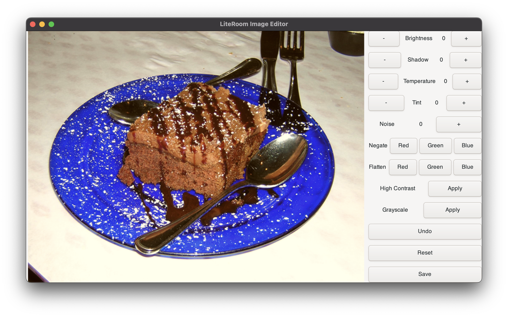

# Image Editor in C with GUI



## Overview

Simple Image Editor is an image editing tool written in C with Graphical User Interface, designed to process and manipulate image files. Users can upload their desired image and adjust various aspects of the photo, such as brightness, contrast, saturation, or temperature. The program supports a select range of edits, and it is designed with simplicity and efficiency in mind, catering to those who need quick modifications to their images without the need for complex software.

## Getting Started

To use this tool, clone the repository 
```bash
git clone https://github.com/chickendreanso/simple-image-editor.git
```

Compile the source code with your C compiler.
```bash
make compile
```
You can directly run the program with the following command. include the name of the file you wish to edit.
```bash
make run filename=./images/cake.ppm //file
```
It will automatically compile the source code and run the program.

The program is run through the command line, where you can specify the image file and desired edits according to the supported formats and commands.

## Features

- **Supported Image Formats**: Currently, the tool supports PPM and BMP file formats for easy manipulation and broad compatibility.
- **GUI Editing**: All edits are made through the Graphical User Interface (GUI), allowing users to specify their desired adjustments in a straightforward manner (e.g., `Brightness`, `Shadow`, etc).
- **Preview and Export**: The program provides a preview of the image while editing. Users can then choose to export and save the file.
- **Undo Functionality**: Supports undoing up to 9 times from the latest state to allow users to revert changes.
- **Limited State Tracking**: To manage memory efficiently and avoid infinite states, the program keeps up to 10 past states of the photo.

## Input and Output Requirements

### Input

- **Image File**: An image in PPM or BMP format.
- **User Commands**: Edits and commands inputted from the GUI.

### Output

- **Edited Image File**: The edited image in the same format as the input.

## Supported Edits

- Brightness
- Contrast
- Shadows
- Temperature
- Tint
- Greyscale Filter
- Image Presets
- Image Resizing

## Parser Requirements

The parser is designed to handle PPM files as shown in the example provided. It will parse the header to determine the image format, size, and maximum RGB value. Each pixel's RGB components are then read and processed according to the user's commands.

## Program State Machine

The program operates in the following states:

1. **Initial**: Awaiting file upload.
2. **Editing State**: User is applying edits to the image.
3. **Exporting State**: User is saving the edited image.

## Editing Image State Machine

To facilitate undoing changes, the program tracks the state of the photo, maintaining up to 10 past states. This allows for significant flexibility in editing, with the following considerations:

- **Reset Functionality**: Users can reset the image to its initial state (no edits).
- **Edit Limitations**: Due to the RGB components being 1 byte each, there's a limit to the degree of edits. The program ensures that edits stay within viable ranges and notifies users if an edit is no longer doable.

## License

This project is licensed under the MIT License - see the LICENSE file for details.
